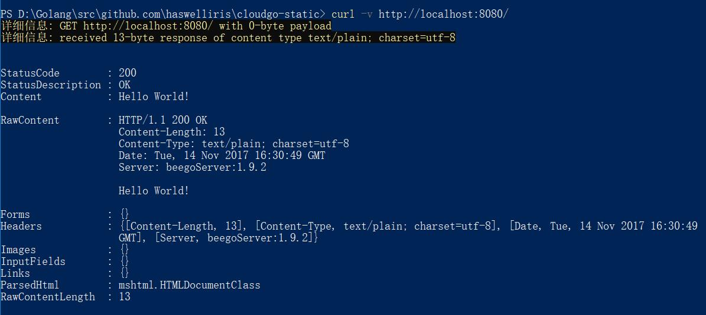
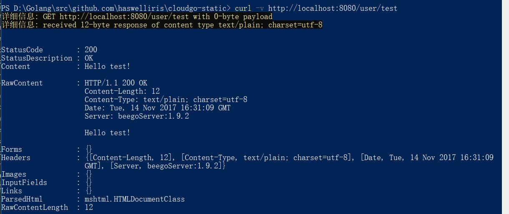
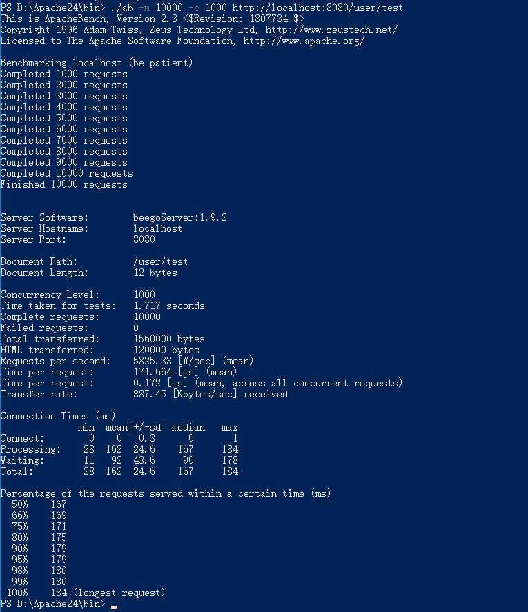

# Cloudgo
## 基本功能
1.在访问“/”时显示“Hello world！”  
2.访问“/user/:name”时显示“Hello name！”其中name是访问时用户自定义的。  

## beego框架
使用了beego框架，因为beego功能全面，教程很丰富，bee工具包一个命令即可创建项目了  
1、安装beego:  
`go get github.com/astaxie/beego`  
2、安装开发工具bee：  
`go get github.com/beego/bee`  
3、创建名为webgo的项目：  
`bee new webgo`  
## 使用curl来测试  
访问http://loacalhost:8080/：  
`curl -v http://loacalhost:8080/`  
   
访问用户test  
`curl -v http://loacalhost:8080/user/test`    
   
## ab测试  
Apache Bench是Apache超文本传输协议(HTTP)的性能测试工具。其设计意图是描绘当前所安装的Apache的执行性能，主要是显示你安装的Apache每秒可以处理多少个请求。  
指令为：  
`./ab -n 10000 -c 1000 http://localhost:8080/user/test`  
其中-n代表执行的请求数量，-c代表并发请求个数  
结果如下：  
  
可以看到每个请求平均消耗时间171ms，平均每秒完成5825个请求（每次并发执行1000个请求），完成所有的10000个请求共用时1.717s  